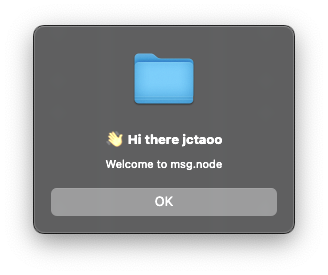

# msg.node



Create message box on windows / macOS

> Just the simple demo of [node.js cpp addon](https://nodejs.org/api/addons.html) with native api.

## Build & Run Example

```bash
yarn install
yarn configure && yarn build
node ./test.js
```

## Installation

```bash
yarn add https://github.com/jctaoo/msg.node.git
```

## Usage

```js
const msg = require("msg.node");

msg.messageBox("jctaoo");
```

### Usage in electron

In electron, you may need using [electron-rebuild](https://github.com/electron/electron-rebuild).

```bash
yarn add electron-rebuild --dev
```

And then add a new script named `postinstall` in your `package.json` just like this:

```json
{
  "scripts": {
    "dev": "electron ./index.js",
    "postinstall": "electron-rebuild"
  }
}
```

And install `msg.node` by steps in [Installation](##Installation). 
